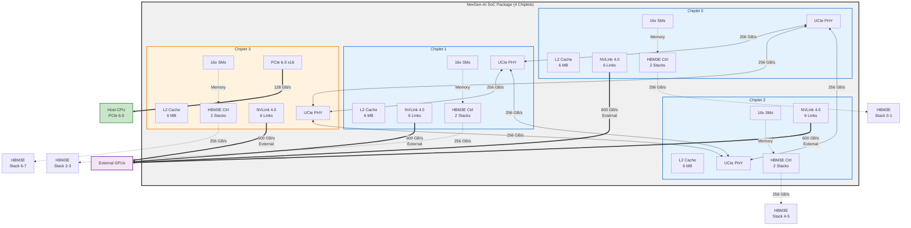
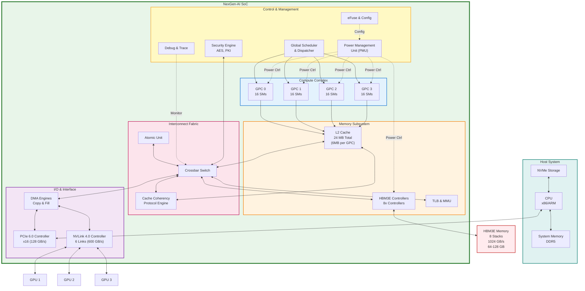
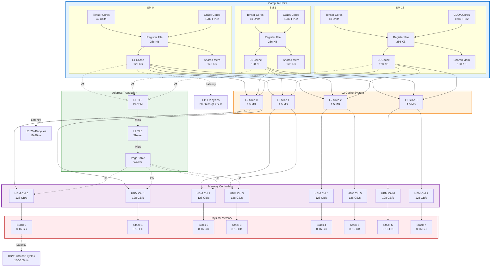
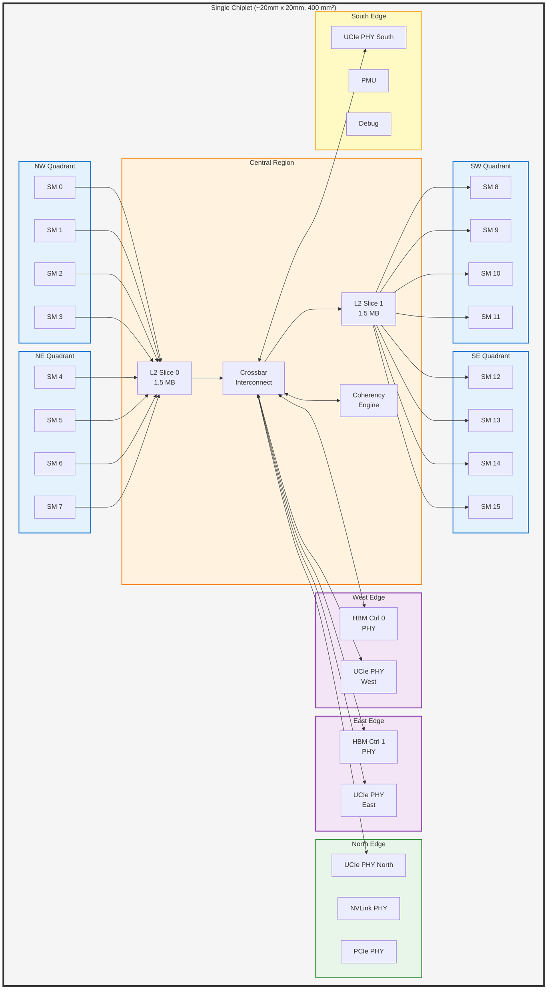
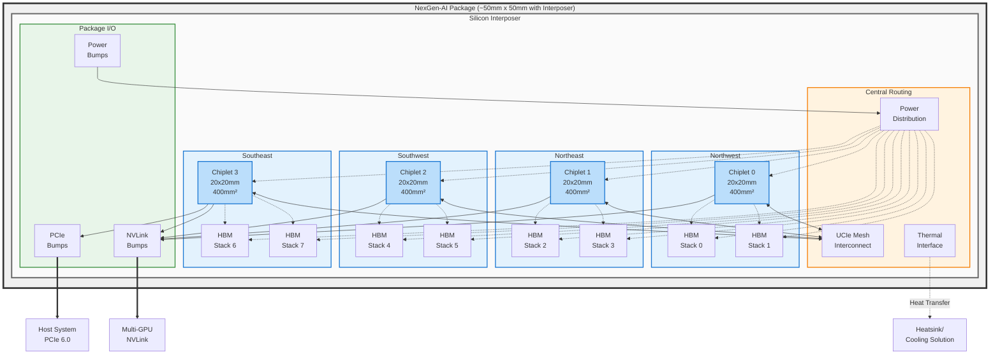
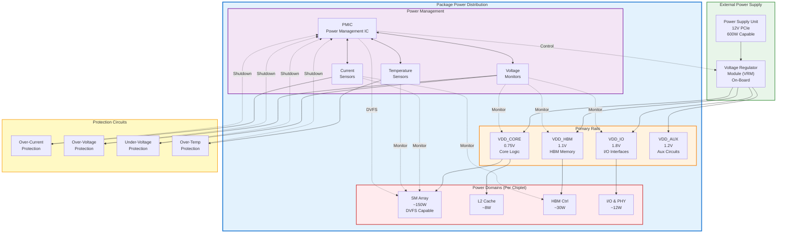

# NexGen-AI SoC Block Diagrams

This document contains comprehensive block diagrams for the NexGen-AI SoC architecture using Mermaid notation.

## Table of Contents
1. [Chiplet Interconnect Topology](#chiplet-interconnect-topology)
2. [System-Level Architecture](#system-level-architecture)
3. [Memory Hierarchy](#memory-hierarchy)
4. [SM (Streaming Multiprocessor) Microarchitecture](#sm-microarchitecture)
5. [Floorplan Conceptual Layout](#floorplan-conceptual-layout)
6. [Power Distribution Network](#power-distribution-network)

---

## Chiplet Interconnect Topology

### 4-Chiplet Configuration with UCIe and NVLink



**Key Features:**
- **Mesh topology** for low-latency chiplet-to-chiplet communication
- **UCIe standard** for die-to-die interconnect (256 GB/s per link)
- **Distributed HBM3E** - 2 stacks per chiplet for balanced bandwidth
- **Chiplet 3** includes PCIe controller for host interface
- **NVLink 4.0** for multi-GPU scaling (600 GB/s aggregate external)

---

## System-Level Architecture

### Complete SoC System Block Diagram



**Architecture Highlights:**
- **4 GPCs (Graphics Processing Clusters)** - Each containing 16 SMs
- **Hierarchical memory** - L1 (per-SM) → L2 (shared) → HBM3E
- **Crossbar interconnect** for non-blocking access patterns
- **Hardware coherency** across all compute units
- **Dedicated DMA engines** for efficient data movement
- **Comprehensive control plane** with power, security, and debug

---

## Memory Hierarchy

### Detailed Memory Subsystem Architecture



**Memory Hierarchy Characteristics:**

| Level | Size (per unit) | Latency | Bandwidth | Scope |
|-------|----------------|---------|-----------|-------|
| Register File | 256 KB | 1 cycle | ~10 TB/s | Per SM |
| Shared Memory | 128 KB | 1-2 cycles | ~8 TB/s | Per SM |
| L1 Cache | 128 KB | 1-2 cycles | ~6 TB/s | Per SM |
| L2 Cache | 6 MB | 20-40 cycles | ~2 TB/s | Per Chiplet |
| HBM3E | 8-16 GB/stack | 200-300 cycles | 128 GB/s/stack | Global |

**Total Capacity:** 64-128 GB HBM3E, 24 MB L2, ~4 MB L1

---

## SM (Streaming Multiprocessor) Microarchitecture

### Detailed SM Block Diagram

```mermaid
graph TB
    subgraph SM["Streaming Multiprocessor (SM)"]
        subgraph FETCH["Instruction Fetch & Decode"]
            I_CACHE["I-Cache<br/>32 KB"]
            FETCH_UNIT["Fetch Unit"]
            DECODE["Decode Unit<br/>4-way"]
            SCOREBOARD["Scoreboard"]
        end
        
        subgraph WARP["Warp Scheduling"]
            WARP_SCHED0["Warp Scheduler 0"]
            WARP_SCHED1["Warp Scheduler 1"]
            WARP_SCHED2["Warp Scheduler 2"]
            WARP_SCHED3["Warp Scheduler 3"]
            DISPATCH["Dispatch Unit"]
        end
        
        subgraph EXEC["Execution Units"]
            direction TB
            
            subgraph TENSOR["Tensor Core Array"]
                TC0["Tensor Core 0<br/>MMA Units"]
                TC1["Tensor Core 1<br/>MMA Units"]
                TC2["Tensor Core 2<br/>MMA Units"]
                TC3["Tensor Core 3<br/>MMA Units"]
            end
            
            subgraph FP32_PIPE["FP32 Pipeline"]
                FP32_0["FP32 Units<br/>32x ALU"]
                FP32_1["FP32 Units<br/>32x ALU"]
                FP32_2["FP32 Units<br/>32x ALU"]
                FP32_3["FP32 Units<br/>32x ALU"]
            end
            
            subgraph INT_PIPE["INT32 Pipeline"]
                INT32_0["INT32 Units<br/>32x ALU"]
                INT32_1["INT32 Units<br/>32x ALU"]
            end
            
            subgraph SPECIAL["Special Function Units"]
                SFU0["SFU 0<br/>Transcendental"]
                SFU1["SFU 1<br/>Transcendental"]
            end
            
            LD_ST["Load/Store Units<br/>32 LSU"]
            TEX["Texture Units<br/>4x Samplers"]
        end
        
        subgraph MEM_SM["SM Memory"]
            RF["Register File<br/>256 KB<br/>65,536 x 32-bit"]
            SHARED["Shared Memory<br/>128 KB<br/>Configurable"]
            L1_DATA["L1 Data Cache<br/>128 KB"]
            CONST_CACHE["Constant Cache<br/>64 KB"]
            TEX_CACHE["Texture Cache<br/>48 KB"]
        end
        
        %% Instruction flow
        I_CACHE --> FETCH_UNIT
        FETCH_UNIT --> DECODE
        DECODE --> SCOREBOARD
        SCOREBOARD --> WARP_SCHED0 & WARP_SCHED1 & WARP_SCHED2 & WARP_SCHED3
        WARP_SCHED0 & WARP_SCHED1 & WARP_SCHED2 & WARP_SCHED3 --> DISPATCH
        
        %% Execution dispatch
        DISPATCH --> TC0 & TC1 & TC2 & TC3
        DISPATCH --> FP32_0 & FP32_1 & FP32_2 & FP32_3
        DISPATCH --> INT32_0 & INT32_1
        DISPATCH --> SFU0 & SFU1
        DISPATCH --> LD_ST
        DISPATCH --> TEX
        
        %% Register file access
        RF <--> TC0 & TC1 & TC2 & TC3
        RF <--> FP32_0 & FP32_1 & FP32_2 & FP32_3
        RF <--> INT32_0 & INT32_1
        RF <--> SFU0 & SFU1
        RF <--> LD_ST
        RF <--> TEX
        
        %% Memory access
        LD_ST <--> L1_DATA
        LD_ST <--> SHARED
        LD_ST <--> CONST_CACHE
        TEX <--> TEX_CACHE
        
    end
    
    %% External connections
    L1_DATA <--> L2["L2 Cache"]
    TEX_CACHE <--> L2
    CONST_CACHE <--> L2
    I_CACHE <--> L2
    
    style SM fill:#e3f2fd,stroke:#1976d2,stroke-width:3px
    style FETCH fill:#fff3e0,stroke:#f57c00,stroke-width:2px
    style WARP fill:#e8f5e9,stroke:#388e3c,stroke-width:2px
    style EXEC fill:#f3e5f5,stroke:#7b1fa2,stroke-width:2px
    style TENSOR fill:#ffebee,stroke:#c62828,stroke-width:2px
    style MEM_SM fill:#fce4ec,stroke:#c2185b,stroke-width:2px
```



**SM Specifications:**
- **Warp Size:** 32 threads
- **Max Warps:** 64 (2048 threads per SM)
- **Registers:** 256 KB (65,536 x 32-bit registers)
- **Shared Memory:** 128 KB (configurable with L1)
- **Peak FP32:** 8.2 TFLOPS @ 2 GHz
- **Peak FP16 (Tensor):** 65.5 TFLOPS @ 2 GHz

---

## Floorplan Conceptual Layout

### Single Chiplet Floorplan (Top View)



### Package-Level Floorplan (4-Chiplet Configuration)



**Package Specifications:**
- **Package Size:** ~50mm x 50mm (2500 mm²)
- **Chiplet Area:** 4 × 400 mm² = 1600 mm²
- **HBM Area:** 8 stacks × ~50 mm² = 400 mm²
- **Interposer Efficiency:** ~64% (chiplets + HBM)
- **Remaining:** Routing, power delivery, thermal interface

---

## Power Distribution Network

### Power Delivery Architecture



**Power Budget Breakdown (4-Chiplet SoC @ 100% Utilization):**

| Component | Power (W) | Percentage |
|-----------|-----------|------------|
| SM Arrays (64 total) | 192 | 72% |
| L2 Caches (24 MB total) | 12 | 4.5% |
| HBM3E (8 stacks) | 40 | 15% |
| HBM Controllers | 10 | 3.7% |
| Interconnect (UCIe) | 8 | 3% |
| I/O (PCIe, NVLink) | 10 | 3.7% |
| **Total Dynamic** | **272 W** | **~100%** |
| Static (Leakage) | 20 | - |
| **Grand Total** | **~292 W** | - |

---

## Usage Notes

### Viewing These Diagrams

1. **GitHub/GitLab:** Renders Mermaid natively
2. **VS Code:** Install "Markdown Preview Mermaid Support" extension
3. **Online:** Use [Mermaid Live Editor](https://mermaid.live/)
4. **Command Line:** Use the rendering tool to generate PNG/SVG images:
   ```bash
   # Install Mermaid CLI
   npm install -g @mermaid-js/mermaid-cli
   
   # Render all diagrams
   python tools/render_diagrams.py --all
   
   # List available diagrams
   python tools/render_diagrams.py --list
   
   # Render specific diagram
   python tools/render_diagrams.py --diagram chiplet
   ```
   See [tools/DIAGRAM_RENDERING.md](../tools/DIAGRAM_RENDERING.md) for details.
5. **Export:** Can be exported to PNG/SVG from Mermaid Live Editor

### Customization

To modify these diagrams:
1. Edit the Mermaid syntax in this markdown file
2. Adjust node names, connections, or styles
3. Change colors by modifying `style` declarations
4. Add/remove components as design evolves

### Integration with Architecture Documentation

These diagrams should be referenced in:
- Architecture specification documents
- Design review presentations
- Hardware/software interface documentation
- Verification planning documents
- Physical design guidelines

---

## Revision History

| Date | Version | Author | Changes |
|------|---------|--------|---------|
| 2026-01-02 | 1.0 | Architecture Team | Initial block diagrams |

---

## Next Steps

1. **Add timing diagrams** for critical paths
2. **Create state machine diagrams** for control logic
3. **Develop interface specifications** with timing parameters
4. **Generate detailed floorplan** with exact dimensions
5. **Model thermal gradients** across package
6. **Create power state transition diagrams**

